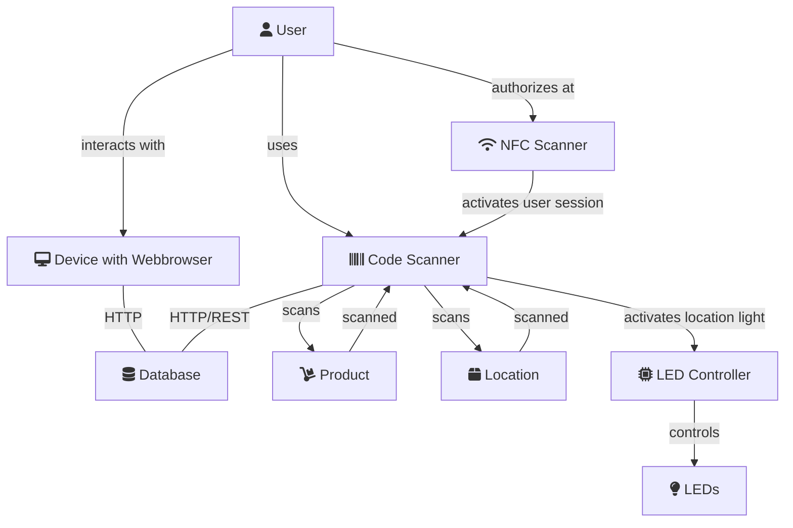

# IoTerminal

## Abstract
Das IoTerminal ermöglicht es Studierenden der TH-Köln das Abholen von angefragter Hardware aus dem things.moxd.io, ohne das ein Mitarbeiter anwesend seien muss. Ähnlich wie eine Packstation sorgt es für eine einfache Ausleihe und Rückgabe. Hierbei wird über ein Pick-by-light System Schnelligkeit und Ordnung garantiert. Jegliche Transaktion wird protokolliert und ist einer Person zugeordnet. 

## Architecture
[back to wiki](https://github.com/nikcani/smart-inventory/wiki#architektur)

[edit graph](https://mermaid-js.github.io/mermaid-live-editor/)

## Documentation
Please have a look at the [Wiki](https://github.com/nikcani/smart-inventory/wiki)
