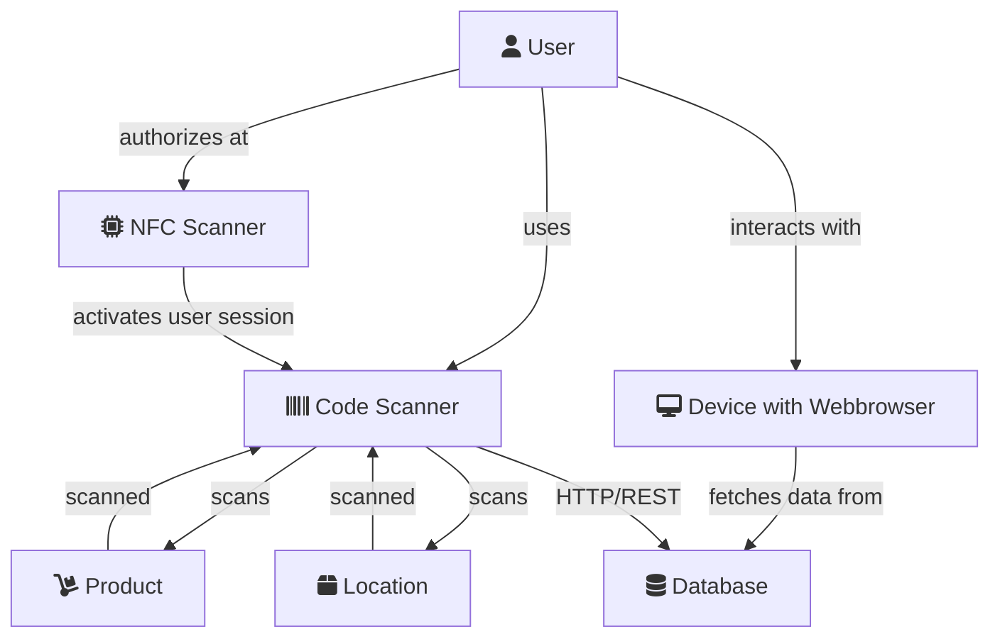

# Smart Inventory

## Abstract
Das Smart Inventory System ermöglicht die schnelle und sichere Inventarisierung unterschiedlichster Objekte. Es ermöglicht die geordnete Ablage, einen guten Überblick und einen schnellen Zugriff. Jegliche Transaktion wird protokolliert und ist einer Person zugeordnet. Das System ist schnell, robust und einfach in der Handhabung.

## Architecture
[back to wiki](https://github.com/nikcani/smart-inventory/wiki#architektur)

[edit graph](https://mermaid-js.github.io/mermaid-live-editor/)

## Documentation
Please have a look at the [Wiki](https://github.com/nikcani/smart-inventory/wiki)
